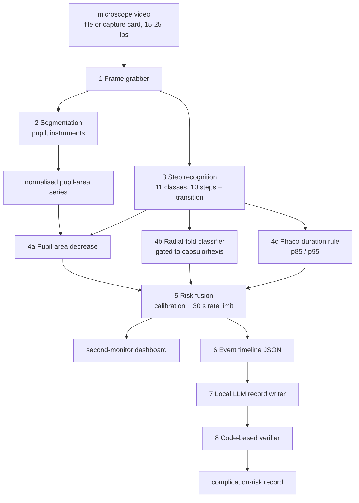

# PhacoGuard: Architecture Summary

*Hackathon deliverable (rule 3.3): architecture summary. Companion: `docs/model_cards/` for per-model metadata.*

## 1. Purpose and scope

PhacoGuard is a research prototype that analyses phacoemulsification microscope video and produces (a) a live, calibrated case-risk band for surgeon awareness and (b) an end-of-case complication-risk record. It is not a medical device and issues no instructions (hackathon rule 5.3).

## 2. System overview

Edit the flowchart below by changing a line, not by realigning characters. GitHub renders
Mermaid natively; the stage table beneath carries the same wiring in a form that diffs cleanly.

### Stage wiring

| From | To | What flows |
|---|---|---|
| video | 1 frame grabber | frames |
| 1 | 2 segmentation | frame |
| 1 | 3 step recognition | frame |
| 2 | 4a pupil-area decrease | normalised pupil area per frame |
| 3 | 4a, 4b, 4c | current step, used as the gate |
| 4a, 4b, 4c | 5 risk fusion | marker flags |
| 5 | dashboard, 6 timeline | risk state, events |
| 6 | 7 record writer | timeline JSON only, never video |
| 7 | 8 verifier | draft record |
| 8 | record | verified record |

All components run on one workstation with a single consumer GPU, with the network disabled.

## 3. Runtime algorithm

What happens per sampled frame. Constants live in the parameter table below and in the files
named there; change them in one place rather than in prose.

1. **Grab** the next frame. Sample at the configured rate rather than decoding every frame.
2. **Locate the limbus.** Re-estimate periodically, smooth over recent accepted estimates, and
   discard an estimate that jumps too far from the previous one.
3. **Choose the segmentation mode** for the current window from the a\* contrast between the
   central disc and the surrounding annulus, with hysteresis. A dense cataract blocks the red
   reflex until the nucleus is gone, so the mode must be free to switch mid-case; the switch time
   is recorded.
4. **Segment the pupil** inside a reduced disc that excludes the sclera ring, and measure area,
   circularity and fill ratio.
5. **Judge the frame clean or occluded.** An instrument across the pupil shrinks the visible mask
   and would otherwise read as a constriction. Occluded frames are excluded before any drop is
   computed.
6. **Predict the surgical step** for the frame and median-filter over a short window.
7. **Update the markers**, each gated to the steps where it is clinically meaningful:
   - pupil-area decrease: a sustained fall below the running maximum, over clean frames only;
   - radial folds: clip classifier during capsulorhexis;
   - prolonged phaco: accumulated phaco time against the reference percentiles.
8. **Group crossings into episodes.** A running maximum decays towards a sustained low, so one
   constriction re-crosses the threshold repeatedly. Merge consecutive crossings when the gap is
   short *and* the pupil does not recover; report one episode with a duration.
9. **Fuse** the markers into `routine` / `rising` / `high`, applying the per-marker rate limit.
10. **Append** each event, with its provenance, to the timeline.

### Parameters

| Parameter | Value | Where it lives |
|---|---|---|
| Pupil drop threshold | 20% below the running maximum | `detectors/pupil_measured.py` |
| Running-maximum window | 30 s | `detectors/pupil_measured.py` |
| Persistence before firing | 10 s of clean frames | `detectors/pupil_measured.py` |
| Minimum window coverage | 60% of expected samples clean | `detectors/pupil_measured.py` |
| Flanking clean samples | 5 each side of the candidate | `detectors/pupil_measured.py` |
| Per-marker rate limit | 30 s | `configs/detectors.yaml`, `pipeline/fusion.py` |
| Episode merge | gap <= 60 s and no recovery to 85% of baseline | `detectors/pupil_measured.py` |
| Occlusion filter | circularity >= 0.55, fill >= 0.80, pupil/limbus <= 0.60 | `detectors/pupil_classical.py` |
| Segmentation mode | decided every 20 s; enter red above +6 a\*, dark below +2 | `detectors/pupil_classical.py` |
| Limbus re-estimation | every 3 s, median of last 5, reject jumps > 20% | `detectors/pupil_classical.py` |
| Pupil gate | `phaco`, `cortex_removal`, `capsule_polishing` | `configs/detectors.yaml`, `data/phase_map.py` |
| Radial-fold gate | `capsulorhexis` | `configs/detectors.yaml`, `data/phase_map.py` |
| Phaco percentiles | p85 and p95 of the labelled reference cases | `configs/detectors.yaml` |
| Risk states | `routine` / `rising` / `high` | `pipeline/fusion.py` |

The phaco reference distribution is computed from the labelled cases, never from Cataract-101,
which is the external test set and must not be used for threshold selection (rule 5).

## 4. Components

| # | Component | Input | Output | Model / method | Licence |
|---|---|---|---|---|---|
| 1 | Frame grabber | video file or HDMI capture | frames at 512x324 | OpenCV | BSD |
| 2 | Segmentation | frame | pupil mask, instrument masks, normalised pupil area | PIDNet (or YOLOX-seg), fine-tuned on CaDIS + Cataract-1K | MIT / Apache-2.0 |
| 3 | Phase recognition | ResNet features over a window | step label + confidence per second | ResNet + GRU; median-filtered. **11 classes**: ten surgical steps plus `transition` | BSD |
| 4a | Pupil-area decrease | normalised pupil-area time series | flag + confidence | drop from a running maximum, gated to phaco / cortex removal / capsule polishing | Apache-2.0 |
| 4b | Radial-fold classifier | 2-4 s clips during capsulorhexis | flag + confidence + one-line explanation | 3D-CNN baseline; optional Qwen3-VL LoRA for explanations | Apache-2.0 |
| 4c | Phaco-duration rule | running phaco-phase duration | flag at 85th / 95th percentile | empirical distribution from public videos; MNGHA prior if tabular data released | n/a |
| 5 | Risk fusion | detector outputs (+ optional pre-op prior) | routine / rising / high, calibrated probability | logistic fusion with isotonic calibration; 30 s per-detector rate limit | n/a |
| 6 | Timeline | events + phases with timestamps | JSON record | schema in `configs/timeline_schema.json` | n/a |
| 7 | Record writer | timeline JSON only (never video) | structured complication-risk record | Qwen3 (4B or 8B, Apache-2.0), LoRA on synthetic JSON-to-record pairs, fixed template | Apache-2.0 |
| 8 | Verifier | record + timeline | pass/fail per statement; factual-accuracy % | regex/field matching | n/a |

## 5. Data flow and privacy boundaries

* **Environment A (team hardware / rented GPU):** public datasets only (Cataract-1K, CaDIS, Cataract-101, Cataract-LMM, Tongren-Zonular-Video). Training and quantitative validation happen here.
* **Environment B (MNGHA sanctioned environment):** institutional data only. Same code, `--offline`. Used for adaptation (fine-tuning last layers on 20-50 local videos if released), fusion calibration, qualitative checks, and the live demo. Only metrics and plots leave; adapted weights are left inside unless the organisers permit export. Temporary files purged at the end (rule 4.3).
* No component makes a network call. Rule 5.2 is satisfied structurally, not by policy.

## 6. Training and evaluation protocol

* Video-level splits: train 70% / validation 15% / test 15% within Cataract-1K, CaDIS, Cataract-LMM; **Cataract-101 is fully held out as the external test set.**
* Thresholds and calibration are fitted on validation, reported on test and external.
* Metrics: pupil Dice/IoU; phase accuracy, per-phase F1, confusion matrix, sequence-order check; per-detector precision, recall, F1, lead time (s), false alerts per case; phaco-duration error (s); record factual accuracy (% verified statements); latency per frame (ms) and end-to-end fps.
* Targets set against published benchmarks: phase accuracy ~90%; pupil Dice 88-90%; radial-fold AUROC ~0.9; >=15 fps on a laptop GPU.

## 7. Interface

Second-monitor web dashboard (FastAPI + static front end, served on localhost): current phase, pupil-area trace, three marker indicators with time since last flag, risk band, event log, end-of-case record. Nothing is drawn inside the surgeon's oculars. All UI text is observational.

## 8. Hardware and runtime

* Development: AMD Radeon RX 7800 XT (16 GB, ROCm) and free-tier cloud GPUs; NVIDIA for optional 7B fine-tunes.
* Inference: any 8-16 GB GPU; models exported to ONNX; device-agnostic PyTorch fallback.
* Language model served locally via Ollama or vLLM, bound to localhost.

## 9. Known limitations

* Radial-fold detector is trained on Chinese and Singaporean video; transfer to Gulf eyes is a stated validation question, not a claim.
* Rare complications (PCR itself) are not detected; the system reports risk awareness, not diagnosis (published PCR detection F1 ~0.61).
* Pupil-area normalisation depends on limbus visibility; heavy glare degrades segmentation.
* Saudi case-mix tuning is a design claim until validated on MNGHA video.

## 10. Provenance

Pre-built on public data before the event and declared at registration (rule 3.2). Tag `pre-event-v1` separates pre-event and in-event work. Generative AI use is disclosed in `docs/AI_DISCLOSURE.md`.

## 11. Surgical step taxonomy

Ten steps in fixed surgical order, plus `transition`:

`incision, ovd_injection, capsulorhexis, hydrodissection, phaco, cortex_removal, capsule_polishing, iol_insertion, ovd_removal, wound_closure` — and `transition`.

`transition` is **not a surgical step**. It is what the system reports between labelled
intervals and appears only as the current-phase label, never as a row in the step list. No
dataset label may map to it; an unmapped label raises, because a silent default would delete a
step from a case.

This replaces an earlier seven-class taxonomy in which OVD injection, capsule polishing, OVD
removal and wound closure were collapsed into a single `idle` class. That hid four real steps and
made `idle` the most frequent label in Cataract-1K: of its 12 labels, 4 fell into `idle`,
accounting for 399 of 887 annotated intervals.

All 12 Cataract-1K labels now map to exactly one step (`configs/phase_map.yaml`). Two map to
`iol_insertion` (implantation and positioning) and two to `ovd_removal` (viscoelastic suction and
anterior-chamber flushing). The phaco mapping is unchanged, so the reference distribution is
identical: n=56, p50 92.3 s, p85 164.8 s, p95 200.7 s.

Gating follows the taxonomy: pupil-area decrease on `phaco`, `cortex_removal` and
`capsule_polishing`; radial folds on `capsulorhexis`.

